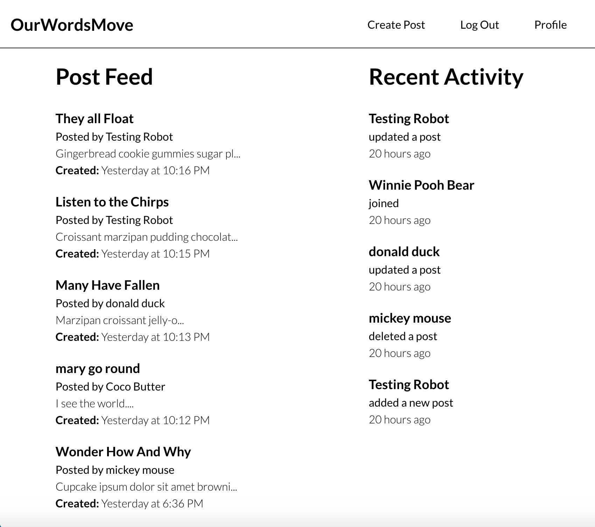

# Renamed to OurWordsMove from ClamClamBlogs

## Objective

Create a responsive blog application where users can sign up to become a member where they will have access to create, edit, and deletes posts. Also offers a notifications feature that displays the 5 most recent user activity.

### Live Demo:

[Blog App](https://clamclamblogs.web.app/)

### Languages / Frameworks / Technologies used:

* HTML
* CSS / SASS
* JavaScript
* React / Redux
* Firebase

  

### Scripts
#### Install dependencies

        yarn
#### Run Application Locally

        yarn start

#### Build Application Prior to Deployment

        yarn run build 
#### Deploy

        firebase deploy

